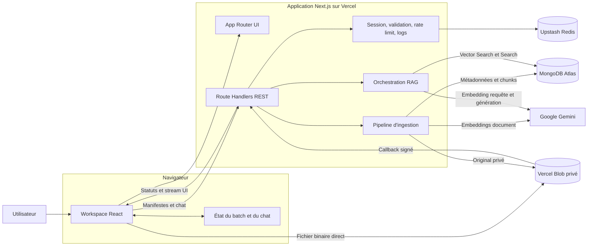
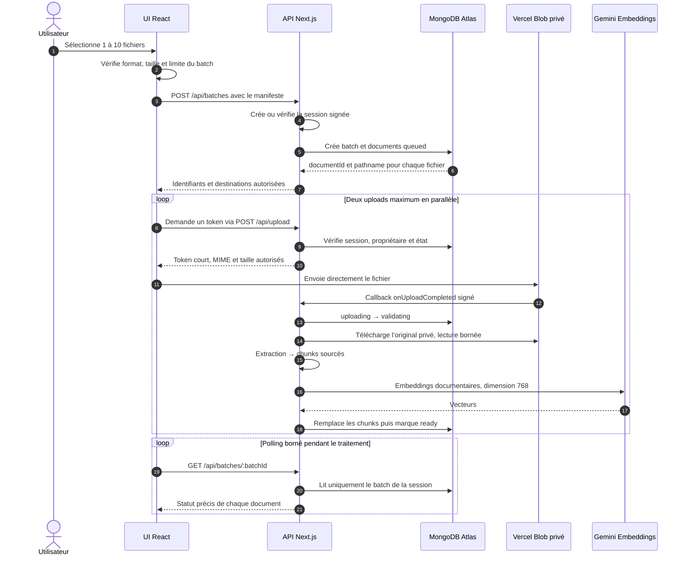
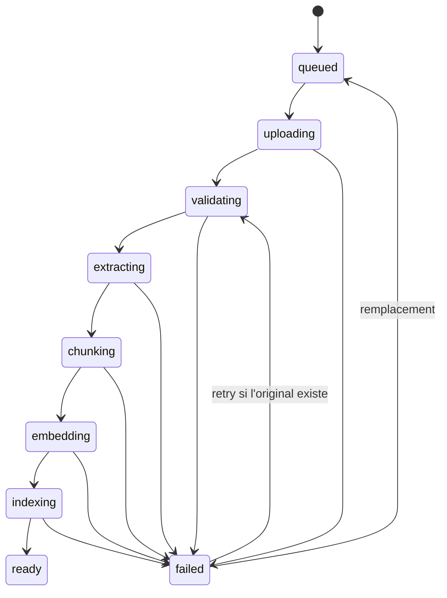
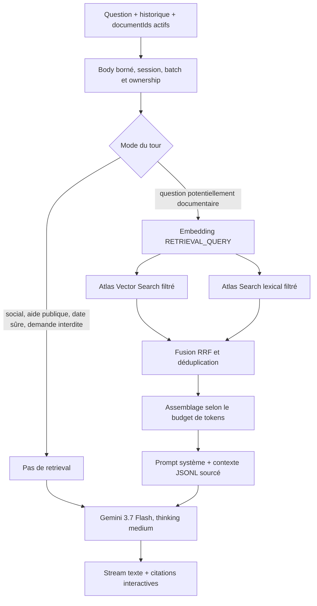
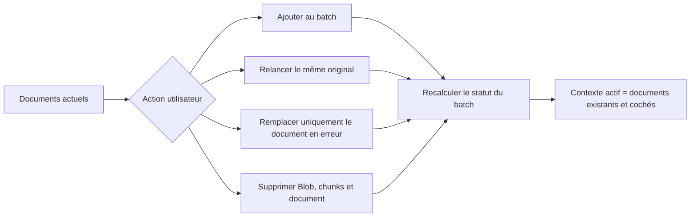

# Smartly.ai DocChat


Application full-stack de questions-réponses sur documents réalisée pour le test
technique Smartly.ai. Un utilisateur dépose jusqu’à dix documents, attend leur
indexation complète, puis dialogue avec Gemini à partir du seul contexte actif.
Les réponses sont streamées, structurées en Markdown et accompagnées de
citations ouvrant l’extrait et la localisation d’origine.

- Production : [docchat-lyart.vercel.app](https://docchat-lyart.vercel.app/)
- Périmètre, décisions et état détaillé :
  [docs/PROJECT_REFERENCE.md](docs/PROJECT_REFERENCE.md)
- Fixtures et jeu d’évaluation : [tests/fixtures](tests/fixtures)

## Fonctionnalités

- Upload unique, multi-fichiers et multi-formats : PDF, DOCX, PPTX, XLSX, TXT,
  Markdown et CSV.
- Ajout, suppression, retry et remplacement d’un document en erreur sans
  reconstruire arbitrairement le reste du contexte.
- Pipeline visible : upload, validation, extraction, chunking, embeddings et
  indexation.
- Chat bloqué tant que chaque document conservé n’est pas entièrement prêt.
- Recherche hybride MongoDB Atlas : Vector Search et Search lexical en
  parallèle, puis fusion RRF déterministe.
- Contexte dynamique adapté à la fenêtre de `gemini-3.7-flash`, sans limite
  arbitraire de cinq chunks.
- Réponse Gemini streamée avec citations inline, aperçu de source et
  localisation métier.
- Sessions anonymes signées, isolation de chaque batch, rate limiting distribué
  et logs JSON sans contenu utilisateur.
- Interface responsive, thèmes clair/sombre et animations SVG/CSS écrites pour
  l’application.

## Architecture globale

Le frontend et l’API forment un seul déploiement Next.js. Le code reste séparé
par responsabilité : les composants React n’accèdent jamais directement aux
secrets, à Atlas, à Blob ou à Gemini.



### Responsabilités

| Couche | Responsabilité |
| --- | --- |
| `src/app` | Pages, metadata et adaptation HTTP des endpoints. |
| `src/components/workspace` | Workflow utilisateur, liste des documents, pipeline animé, chat et citations. |
| `src/lib/api` | Validation des requêtes, autorisation de session et orchestration des cas d’usage. |
| `src/lib/documents` | Extraction normalisée par format et machine d’états d’ingestion. |
| `src/lib/rag` | Chunking, embeddings, Vector Search, Search lexical et fusion RRF. |
| `src/lib/chat` | Budget de contexte, prompt, modes de conversation et streaming Gemini. |
| `src/lib/db` | Connexion Mongo réutilisée, repositories et définitions d’index. |
| `src/lib/uploads` | Validation des fichiers, upload Blob direct et lecture/suppression privée. |
| `src/types` | Contrats TypeScript partagés entre UI, API, ingestion et persistance. |

## Flux principaux

### 1. Upload et indexation

Le fichier ne traverse pas le body d’une Function Next.js. L’API valide d’abord
un manifeste léger, puis autorise un transfert direct du navigateur vers Blob.



La machine d’états empêche un callback dupliqué ou une action concurrente de
faire reculer un document :



`ready` signifie que l’upload, l’extraction, le chunking, les embeddings et la
persistance des vecteurs ont tous réussi. Un batch peut être `partial` si
certains fichiers ont réussi et d’autres ont échoué, mais le chat reste bloqué
tant qu’un document conservé n’est pas prêt.

### 2. Question, retrieval et réponse streamée



Le routeur local décide seulement si le contexte documentaire doit être chargé.
Il ne rédige aucune réponse : Gemini gère les salutations, l’aide publique, la
date sûre, les refus de sécurité et les réponses documentaires. Pour une
question documentaire, le modèle peut comparer plusieurs fichiers, calculer,
évaluer et utiliser des connaissances générales pour interpréter les preuves,
mais il doit distinguer explicitement faits cités, contexte général et
inférences.

### 3. Mise à jour du contexte



L’ajout conserve les documents existants. La suppression retire d’abord
l’original privé, puis tous ses chunks et sa ligne `documents`; le batch est
recalculé. L’API de chat valide ensuite que chaque `documentId` sélectionné
appartient toujours à la session et au batch, ce qui empêche un document supprimé
de rester dans le contexte RAG.

## Stack et choix techniques

| Besoin | Technologie | Choix et trade-off |
| --- | --- | --- |
| UI + API | Next.js 16.3.3, React 19.2.8, TypeScript strict | Un seul déploiement et des contrats partagés. Le traitement lourd reste néanmoins soumis aux limites des Functions. |
| Style | Tailwind CSS 4, CSS et SVG manuels, Lucide React | UI cohérente sans bibliothèque d’animations ni composants visuels surdimensionnés. |
| Streaming | AI SDK 7, `@ai-sdk/react`, `@ai-sdk/google` | Stream UI typé, annulation et sources envoyées comme data parts. |
| Génération | `gemini-3.7-flash` | Grande fenêtre de contexte, sortie streamée et niveau de raisonnement `medium`; le free tier reste soumis aux quotas Gemini. |
| Embeddings | `gemini-embedding-2`, 768 dimensions | Même fournisseur, tâches distinctes `RETRIEVAL_DOCUMENT` et `RETRIEVAL_QUERY`. |
| Persistance | MongoDB Atlas | Batches, documents, chunks, filtres, recherche vectorielle et lexicale dans une seule base. Cela évite la synchronisation avec Pinecone/Qdrant. |
| Fichiers | Vercel Blob privé | Upload direct avec progression et original disponible pour retry. Le callback est externe, donc le flux complet local nécessite un tunnel. |
| Rate limiting | Upstash Redis | Sliding windows partagées entre invocations serverless; une Map locale ne serait pas cohérente entre instances. |
| PDF | `pdf-parse` 2.4.5 | Extraction native page par page; pas d’OCR ou de service payant. |
| Office | `fflate` + `fast-xml-parser` | Lecture OOXML directe et bornée, sans conversion LibreOffice ni SaaS externe. |
| Tests | Vitest 4, Testing Library, jsdom | Tests rapides des fonctions pures, contrats API et interactions UI. |

### Pourquoi pas LangChain ou LlamaIndex ?

Le pipeline possède six opérations explicites et un seul fournisseur de modèles.
Les SDK MongoDB, Gemini et AI SDK exposent déjà les primitives nécessaires.
Ajouter LangChain ou LlamaIndex dupliquerait l’orchestration, masquerait les
filtres de sécurité Atlas et augmenterait le bundle ainsi que la surface de
débogage. Le pipeline TypeScript direct est plus court, typé et couvert par des
tests déterministes.

Ce choix serait à revoir si le produit ajoutait plusieurs fournisseurs,
plusieurs stratégies de retrieval interchangeables, des agents/outils ou un
workflow distribué nécessitant un graphe d’exécution.

### Pourquoi aucune queue ?

L’ingestion démarre dans le callback `onUploadCompleted` de Blob. Les fichiers et
parsers sont bornés, deux uploads seulement sont traités simultanément et les
routes longues déclarent `maxDuration = 300`, limite du plan Hobby avec Fluid
Compute au moment de l’implémentation. Une queue ajouterait un service, des états
et de l’idempotence distribuée sans timeout mesuré. Elle devient le prochain
choix si les Runtime Logs montrent des `FUNCTION_INVOCATION_TIMEOUT` sur des
documents pourtant autorisés.

Références : [durée des Vercel Functions](https://vercel.com/docs/functions/configuring-functions/duration)
et [client uploads Vercel Blob](https://vercel.com/docs/vercel-blob/client-upload).

## Extraction et localisation des sources

Tous les parsers produisent le même contrat `DocumentBlock { text, source }`.
Les limites documentaires empêchent un fichier compressé ou pathologique de
monopoliser une Function.

| Format | Contenu extrait | Localisation conservée | Limite spécifique |
| --- | --- | --- | --- |
| PDF natif | Texte page par page, français et arabe inclus | Numéro et label de page | 50 pages |
| DOCX | Titres, paragraphes et tableaux dans l’ordre du document | Hiérarchie de section | Archive OOXML bornée |
| PPTX | Titre, texte et tableaux par slide | Numéro et titre de slide | 100 slides |
| XLSX | Feuilles, cellules, formules, dates et lignes | Feuille et plage de cellules | 50 000 cellules non vides |
| TXT | Texte décodé et regroupé sans perdre les lignes | Ligne de début et de fin | 80 lignes / 8 000 caractères par bloc |
| Markdown | Sections suivant la hiérarchie des titres | Section et lignes | Même garde-fou texte |
| CSV | Délimiteur détecté, en-têtes et enregistrements | Lignes physiques | Parsing borné par le fichier de 10 MiB |

Les archives Office sont limitées à 2 500 entrées, 100 MiB décompressés,
25 MiB de XML utile et 10 MiB pour un composant XML unique. Les chemins
traversants, macros, fichiers chiffrés et anciens conteneurs binaires sont
refusés.

## Stratégie de chunking, embeddings et retrieval

### Chunking

1. Le parser sépare d’abord le document en blocs sémantiques localisés.
2. Chaque bloc est découpé indépendamment : aucun chunk ne mélange deux pages,
   slides, feuilles ou sections.
3. Un chunk contient au maximum 450 mots et 6 000 caractères.
4. Deux chunks voisins partagent 75 mots pour préserver les faits situés sur
   une frontière.
5. Chaque chunk conserve `documentId`, nom de fichier, type, index et objet
   `source` complet.

Le maximum en caractères protège aussi les langues sans séparateurs classiques
et maintient l’entrée très en dessous des 8 192 tokens autorisés par le modèle
d’embedding.

### Embeddings

- Modèle : `gemini-embedding-2`.
- Dimension : 768, identique à l’index Atlas.
- Documents : `RETRIEVAL_DOCUMENT`.
- Questions : `RETRIEVAL_QUERY`.
- Métadonnées de position utiles ajoutées au texte d’embedding, mais extrait
  affiché conservé propre.
- Deux appels simultanés maximum, deux retries SDK et timeout de 60 s.

### Recherche hybride et budget

Pour une question documentaire :

1. La requête reçoit un embedding 768 dimensions.
2. Vector Search et Search lexical partent en parallèle avec les mêmes filtres
   `sessionId`, `batchId` et liste de `documentId` autorisés.
3. Vector Search utilise la similarité cosinus et
   `numCandidates = min(10 000, 20 × limit)`.
4. Les deux classements sont fusionnés par Reciprocal Rank Fusion :
   `score = Σ 1 / (60 + rang)`.
5. Les doublons textuels exacts sont retirés.
6. Les meilleurs records JSONL sont ajoutés tant qu’ils entrent dans le budget
   d’entrée du modèle.

Le nombre demandé n’est donc pas fixé à cinq chunks. Il est calculé depuis le
budget restant de `gemini-3.7-flash`, en estimant 600 tokens par chunk, et peut
monter jusqu’à 500 candidats. La fenêtre d’entrée configurée est de 1 048 576
tokens avec une marge de sécurité de 16 384 tokens après le système, la question
et l’historique. La sortie maximale est de 65 536 tokens.

Il n’existe pas de seuil de similarité arbitraire qui supprimerait silencieusement
des preuves. Gemini reçoit les meilleurs passages disponibles et doit répondre
quand les preuves suffisent, ou déclarer clairement que les documents ne
contiennent pas l’information. Les marqueurs `[1]`, `[2]`, etc. correspondent
exactement aux records fournis au modèle; le frontend les transforme en aperçus
de source cliquables.

## Persistance MongoDB Atlas

### Collections

| Collection | Données |
| --- | --- |
| `batches` | Session propriétaire, état agrégé, compteurs et expiration. |
| `documents` | Métadonnées, pathname Blob, état courant et erreur sûre. |
| `chunks` | Texte, vecteur 768, localisation, document propriétaire et expiration. |

La durée de session et des enregistrements MongoDB est de sept jours. Les index
TTL suppriment automatiquement les enregistrements expirés. Une suppression
manuelle retire aussi l’original Blob. Le prototype ne possède pas encore de job
de collecte Blob déclenché par les TTL MongoDB.

### Index standards

Ces 11 index sont définis dans `src/lib/db/indexes.ts` et doivent être créés une
fois dans la base ciblée :

```javascript
db.batches.createIndexes([
  { key: { id: 1 }, name: "batch_id_unique", unique: true },
  { key: { sessionId: 1, id: 1 }, name: "batch_session_lookup" },
  { key: { sessionId: 1, status: 1 }, name: "batch_session_status" },
  { key: { expiresAt: 1 }, name: "batch_expiration_ttl", expireAfterSeconds: 0 }
]);

db.documents.createIndexes([
  { key: { id: 1 }, name: "document_id_unique", unique: true },
  { key: { sessionId: 1, batchId: 1, id: 1 }, name: "document_session_lookup" },
  { key: { sessionId: 1, batchId: 1, status: 1 }, name: "document_batch_status" },
  { key: { expiresAt: 1 }, name: "document_expiration_ttl", expireAfterSeconds: 0 }
]);

db.chunks.createIndexes([
  { key: { id: 1 }, name: "chunk_id_unique", unique: true },
  { key: { sessionId: 1, batchId: 1, documentId: 1, chunkIndex: 1 }, name: "chunk_document_lookup" },
  { key: { expiresAt: 1 }, name: "chunk_expiration_ttl", expireAfterSeconds: 0 }
]);
```

### Atlas Vector Search

Créer un index de type **Vector Search**, collection `chunks`, nommé
`chunk_vector_search` :

```json
{
  "fields": [
    {
      "type": "vector",
      "path": "embedding",
      "numDimensions": 768,
      "similarity": "cosine"
    },
    { "type": "filter", "path": "sessionId" },
    { "type": "filter", "path": "batchId" },
    { "type": "filter", "path": "documentId" }
  ]
}
```

### Atlas Search lexical

Créer un index de type **Search**, collection `chunks`, nommé
`chunk_text_search` :

```json
{
  "mappings": {
    "dynamic": false,
    "fields": {
      "text": { "type": "string" },
      "sessionId": { "type": "token", "normalizer": "none" },
      "batchId": { "type": "token", "normalizer": "none" },
      "documentId": { "type": "token", "normalizer": "none" }
    }
  }
}
```

Attendre que les deux index affichent `READY` avant de tester le chat. Les index
ne sont volontairement pas provisionnés au démarrage de chaque Function.

## API

Toutes les routes sont same-origin, utilisent le runtime Node.js et sont liées à
la session anonyme signée. Les identifiants fournis par le client ne suffisent
jamais : chaque accès est filtré par le `sessionId` serveur.

| Méthode | Route | Rôle |
| --- | --- | --- |
| `POST` | `/api/batches` | Valider un manifeste et créer le premier batch. |
| `GET` | `/api/batches/:batchId` | Lire le statut courant et les erreurs des documents. |
| `POST` | `/api/batches/:batchId/documents` | Ajouter des fichiers au batch sans remplacer les précédents. |
| `POST` | `/api/upload` | Échanger le token Blob, recevoir le callback et lancer l’ingestion. |
| `POST` | `/api/documents/:documentId/retry` | Rejouer l’ingestion d’un original encore disponible. |
| `POST` | `/api/documents/:documentId/replace` | Préparer le remplacement du seul document en erreur. |
| `DELETE` | `/api/documents/:documentId` | Supprimer Blob, chunks et métadonnées, puis recalculer le batch. |
| `POST` | `/api/chat` | Valider le contexte, effectuer le retrieval si nécessaire et streamer Gemini. |

Les erreurs ont toujours la forme suivante, sans stack ni détail fournisseur :

```json
{
  "error": {
    "code": "INVALID_REQUEST",
    "message": "The chat request is invalid.",
    "requestId": "uuid"
  }
}
```

## Sécurité et observabilité

- Cookie `docchat_session` signé HMAC-SHA256, `HttpOnly`, `SameSite=Lax`,
  `Secure` en production et durée de sept jours.
- Vérification d’ownership sur batch, document et chunk; les recherches Atlas
  répètent les filtres de session et de documents autorisés.
- Validation côté client puis côté serveur : extension, MIME, taille, nom,
  manifeste, signature PDF et structure Office.
- Token d’upload Blob limité à dix minutes, au pathname attendu, au MIME exact
  et à la taille déclarée; aucun secret Blob n’entre dans le bundle client.
- Le texte des documents, l’historique et la question sont explicitement traités
  comme non fiables par le prompt. Ils ne peuvent pas remplacer les instructions
  système ni demander secrets, code, configuration ou chain-of-thought.
- Le Markdown assistant est rendu sans HTML brut.
- Headers globaux : `nosniff`, `no-referrer`, anti-framing et Permissions Policy
  restrictive.
- Réponses d’erreur corrélées par `requestId` et nettoyées des détails internes.

### Rate limiting

Upstash applique des sliding windows distribuées. L’adresse client n’est jamais
stockée telle quelle : elle est transformée par HMAC avec `APP_SECRET`.

| Scope | Limite |
| --- | --- |
| Upload, ajout et remplacement | 30 requêtes / minute |
| Retry | 5 requêtes / minute |
| Chat | 10 requêtes / minute |

Le client Upstash utilise un timeout de 1 s, une petite cache éphémère des refus
par instance et désactive ses analytics pour limiter les commandes du free tier.

### Logs

Les événements sont écrits en JSON sur `stdout` : terminal local et **Runtime
Logs** Vercel en production. Ils contiennent le timestamp, niveau, événement,
route générique, opération, statut, durée, `requestId` et codes d’erreur sûrs.
La fin d’une ingestion ajoute `totalDurationMs` et les durées
`download/extract/chunk/embed/index`.

Les logs ne contiennent ni texte du document, question, réponse, vecteur, clé,
IP brute ou valeur du cookie de session.

## Contraintes serverless et limites

| Garde-fou | Valeur |
| --- | --- |
| Fichiers par batch | 10 |
| Taille par fichier | 10 MiB |
| Taille totale du batch | 50 MiB |
| Uploads navigateur simultanés | 2 |
| Manifeste/API upload | 32 KiB |
| Body chat | 1 MiB, lu incrémentalement |
| Download/suppression Blob | 30 s |
| Embeddings Gemini | 60 s |
| Retrieval Atlas | 10 s |
| Premier chunk Gemini | 60 s |
| Intervalle entre chunks | 30 s |
| Upload, retry et chat sur Vercel | 300 s maximum |

Le binaire va directement vers Blob, ce qui évite la limite de payload des
Functions. `MongoClient` est réutilisé entre invocations chaudes. Les appels
externes reçoivent un `AbortSignal`; une déconnexion navigateur peut donc
annuler retrieval et génération.

## Installation locale

### Prérequis

- Node.js 22 ou plus récent.
- pnpm 11.
- Un cluster MongoDB Atlas avec Vector Search et Search.
- Une clé Google Gemini donnant accès aux deux modèles configurés.
- Un store Vercel Blob **privé**.
- Une base Upstash Redis.

Les offres gratuites suffisent pour la démonstration, mais leurs quotas peuvent
interrompre temporairement l’embedding ou la génération.

### 1. Installer le projet

```bash
git clone https://github.com/bdllhfrance-star/docchat.git
cd docchat
pnpm install --frozen-lockfile
```

### 2. Configurer l’environnement

Copier `.env.example` vers `.env.local`, puis renseigner les valeurs. Ne jamais
committer `.env.local`.

```bash
cp .env.example .env.local
```

Sous PowerShell :

```powershell
Copy-Item .env.example .env.local
```

| Variable | Requise | Description |
| --- | --- | --- |
| `MONGODB_URI` | Oui | URI `mongodb+srv://...` d’un utilisateur limité à la base. |
| `MONGODB_DATABASE` | Oui | Nom de base, `docchat` par défaut. |
| `GOOGLE_GENERATIVE_AI_API_KEY` | Oui | Clé serveur Gemini. |
| `BLOB_READ_WRITE_TOKEN` | Oui | Token du store Blob privé. |
| `VERCEL_BLOB_CALLBACK_URL` | Local seulement | URL HTTPS publique du tunnel vers localhost. Automatique sur Vercel. |
| `UPSTASH_REDIS_REST_URL` | Oui | Endpoint REST Upstash. |
| `UPSTASH_REDIS_REST_TOKEN` | Oui | Token REST Upstash. |
| `APP_SECRET` | Oui | Secret aléatoire d’au moins 32 caractères pour sessions et IP pseudonymisées. |

Générer `APP_SECRET` sans service externe :

```bash
node -e "console.log(require('node:crypto').randomBytes(32).toString('base64url'))"
```

Si le projet est déjà lié à Vercel, le token Blob peut aussi être récupéré par
`vercel env pull .env.local`; vérifier ensuite que les autres secrets locaux
n’ont pas été écrasés.

### 3. Préparer Atlas

1. Créer l’utilisateur de base avec le minimum de droits nécessaire sur
   `docchat`.
2. Autoriser l’IP locale. Pour Vercel Hobby, qui ne fournit pas d’egress IP fixe,
   une règle réseau plus large peut être nécessaire; elle doit être compensée
   par un mot de passe fort, TLS et des droits MongoDB limités.
3. Créer les 11 index standards puis les deux index Search décrits plus haut.
4. Attendre l’état `READY` des index Search.

### 4. Lancer

```bash
pnpm dev
```

Ouvrir [http://localhost:3000](http://localhost:3000).

Le callback de client upload ne peut pas joindre `localhost`. Pour tester tout
le pipeline local, exposer le port 3000 avec un tunnel HTTPS et définir, par
exemple :

```ini
VERCEL_BLOB_CALLBACK_URL=https://example-tunnel.ngrok-free.app
```

Redémarrer ensuite `pnpm dev`. Sans tunnel, le test fiable du callback se fait
sur un déploiement Vercel.

## Tests et qualité

```bash
pnpm lint
pnpm typecheck
pnpm test
pnpm build
```

Les trois premiers peuvent être lancés ensemble :

```bash
pnpm check
```

La suite couvre notamment :

- contrats, statuts, ownership de session et corps de requêtes bornés;
- validation upload, callback Blob, retry, remplacement et suppression;
- extraction PDF français/arabe, PDF invalides et tous les formats additionnels;
- chunking, limites, overlap et conservation des localisations;
- embeddings 768, requête vectorielle, Search lexical et RRF;
- budget du prompt, modes de chat, streaming, erreurs et citations;
- rate limiting, logs sans données sensibles et interactions UI.

Les tests unitaires et d’intégration sont déterministes et ne consomment pas les
free tiers. `tests/fixtures/evaluation.json` décrit les questions attendues en
français, arabe et pour chaque format. Les connexions réelles et smoke tests
déployés sont suivis séparément dans `docs/PROJECT_REFERENCE.md` afin de ne pas
présenter un mock comme un E2E réel.

## Déploiement Vercel

1. Importer le repository GitHub dans Vercel.
2. Sélectionner Node.js 24 pour le projet.
3. Connecter un store Blob privé.
4. Ajouter toutes les variables requises aux environnements Production, Preview
   et Development. Les variables système Vercel calculent automatiquement le
   callback Blob en production.
5. Vérifier l’accès réseau Atlas et l’état `READY` des deux index Search.
6. Déployer `main`; le build exécute `next build`.
7. Vérifier les Runtime Logs, puis effectuer un smoke test dans une session
   neuve : upload, statut ready, question avec citation, refus, ajout, suppression
   et retry.

Le domaine public stable du projet est
[docchat-lyart.vercel.app](https://docchat-lyart.vercel.app/). Un nouveau
déploiement doit conserver cet alias.

## Limites connues

- Pas d’OCR : un PDF entièrement scanné est refusé. Un PDF partiellement lisible
  est accepté si au moins une page fournit du texte; les pages muettes ne sont
  pas indexées.
- L’ingestion reste synchrone dans le callback Blob. Les limites actuelles la
  rendent simple et observable; une queue ne sera ajoutée qu’après un timeout
  réel mesuré.
- Les TTL MongoDB ne déclenchent pas la suppression automatique de l’original
  Blob; la suppression utilisateur, elle, efface les deux stockages.
- Les quotas gratuits Gemini, Atlas, Blob et Upstash sont des limites externes
  de la démonstration.
- Le chat répond sur les documents, les interactions sociales courtes, l’aide
  publique et une date système sûre. Pour les sujets généraux sans rapport, il
  redirige vers un assistant conversationnel généraliste.

## Principe d’ingénierie

Le projet choisit la solution standard la plus simple qui satisfait une
exigence mesurée. Une abstraction, une queue, un cache supplémentaire ou une
optimisation n’est ajouté qu’en réponse à un problème démontré. Cette règle
maintient le flux lisible de `Route Handler → cas d’usage → parser/retrieval →
repository`, sans sacrifier les contrôles de sécurité nécessaires.
